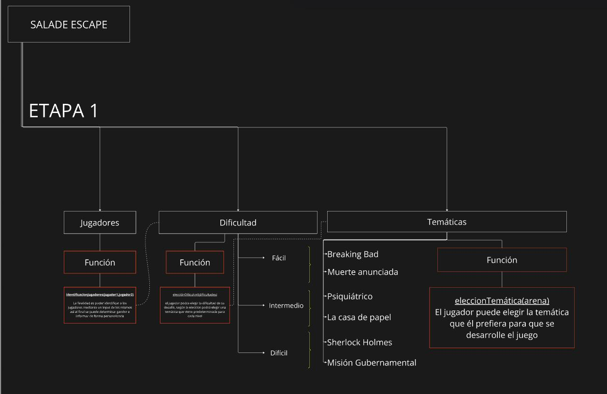

EscapeRoom

 Trabajo Practico Obligatorio Algoritmos I - UADE
 Autores: * Joaquin Fernandes - Claribel Pereyra - Lucas Vitale | Equipo 16

 El juego consiste en escapar de una sala generada de forma aleatoria, donde el jugador deberá resolver acertijos para poder escapar. El mismo será hecho con código de Python y utilizando los temas vistos en la materia de Programación I de la carrera de Lic. en Gestión IT.

 ## Documentación
 Sala de Escape

 ## 🔛 Getting Started
 ### Prerequisitos

    > #### Python 
    - Descargar [Python](https://www.python.org/downloads/).
    - Instalá Python y con figurá las variables de entorno.
    - Podés verificar que lo hayas hecho correctamente corriendo *python --version* desde cualqueir consola o termina en tu computadora
    +

    jajjajajajaj 